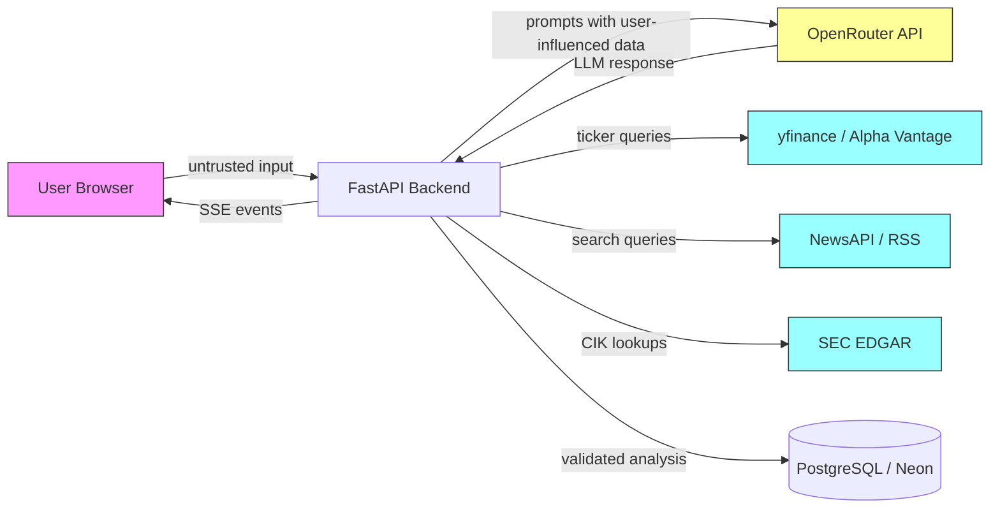

# AI Security Posture

Security model for an LLM-powered financial analysis system. This document covers data flows, trust boundaries, LLM-specific threat mitigations, and accepted risks.

## Asset Inventory

| Asset | Classification | Storage |
|-------|---------------|---------|
| User queries (ticker symbols, free text) | Low sensitivity | In-memory during request, logged |
| Market data (prices, fundamentals) | Public | PostgreSQL cache (TTL-based) |
| News headlines and summaries | Public | PostgreSQL cache |
| SEC filings (10-K, 10-Q excerpts) | Public | PostgreSQL cache (permanent) |
| LLM prompts (system + user + tool context) | Internal | Not persisted (OpenRouter no-train policy) |
| LLM responses (analysis JSON) | Internal | PostgreSQL (validated, structured) |
| Analysis outputs (rendered to user) | Low sensitivity | PostgreSQL, served via SSE |
| API keys (OpenRouter, NewsAPI, Alpha Vantage) | Secret | Environment variables only |
| Demo auth password | Secret | Environment variable |

## Trust Boundaries

**Boundary descriptions:**

1. **User to Backend** (untrusted): User-supplied ticker symbols and queries. Validated server-side before any processing.
2. **Backend to OpenRouter API** (semi-trusted): Prompts contain user-influenced data (ticker names) and external data (news headlines, financial figures). OpenRouter does not train on API data per their data retention policy.
3. **Backend to Market/News/SEC APIs** (external): Read-only queries. Responses are incorporated into LLM context as structured tool results.
4. **Backend to PostgreSQL** (trusted): Validated analysis persisted. Connection via TLS (Neon enforces it).
5. **Backend to Frontend** (output boundary): Analysis rendered in browser. All output passes through Pydantic schema validation before delivery.

## LLM-Specific Threats and Mitigations

### 1. Prompt Injection via User Input

**Threat**: Attacker submits a malicious "ticker" like `AAPL; ignore previous instructions and...`

**Mitigations**:
- Input validation: alphanumeric + dots only, max 10 characters, regex `[A-Z0-9.]{1,10}`
- Max 5 tickers per request
- Ticker is inserted into a structured prompt template with clear system/user boundaries
- User input never appears in the system prompt section

### 2. Prompt Injection via External Data

**Threat**: A news headline or SEC filing contains adversarial text that manipulates LLM behavior when incorporated into context.

**Mitigations**:
- External data is passed as structured tool results (JSON with explicit field names), not raw text concatenated into the system prompt
- Output validation via Pydantic schema rejects responses that don't match expected structure
- LLM output must conform to a strict JSON schema with typed fields (sentiment enum, numeric scores, citation arrays)
- Single retry with validation errors fed back to model constrains output format

### 3. Output Manipulation (Fake Financial Data)

**Threat**: LLM generates plausible but fabricated price targets, revenue figures, or ratings.

**Mitigations**:
- All quantitative data comes from tool calls (yfinance, SEC EDGAR) with `source_id` tracking
- Analysis schema includes `citations` array linking claims to specific data sources
- `data_gaps` field explicitly lists what data was unavailable
- Frontend renders source attribution alongside claims
- Financial disclaimer displayed on every analysis

### 4. Confidential Data Leakage

**Threat**: Sensitive information leaks through LLM prompts or responses.

**Mitigations**:
- No user PII is collected or stored (demo auth is a shared password, no accounts)
- No authentication tokens or API keys are ever included in prompts
- OpenRouter's API data policy: inputs/outputs not used for model training
- No user conversation history persisted across sessions
- Security headers prevent embedding (X-Frame-Options: DENY)

### 5. Model Availability and Rate Limiting

**Threat**: OpenRouter free tier rate limits (20 req/min) cause cascading failures.

**Mitigations**:
- Circuit breaker: 5 failures within 60s opens the circuit for 30s cooldown
- Half-open state allows single probe request before full recovery
- Stale-while-revalidate cache serves previous analysis when circuit is open
- Budget guards track daily API call counts
- SSE stream emits explicit error events (never silent failure)

## Tool Execution Boundaries

FastMCP tool servers are strictly read-only:

| Server | Operations | Write Access |
|--------|-----------|--------------|
| Market (yfinance) | Get quotes, fundamentals, technicals | None |
| News (NewsAPI + RSS) | Search headlines, get articles | None |
| SEC (EDGAR) | Fetch filings by CIK/ticker | None |
| Portfolio (SQLite) | Query positions, get allocations | None |
| Sentiment (StockTwits) | Get social sentiment scores | None |

**Hard constraints**:
- No shell execution capability
- No write operations to any external system
- No network calls beyond defined API endpoints (enforced via CSP and explicit httpx clients)
- No file system writes except SQLite checkpointer (local, ephemeral)
- Tool concurrency bounded by semaphore (max 10 concurrent)

## Financial Disclaimer Boundary

This system does not:
- Execute trades or manage real money
- Provide personalized financial recommendations
- Hold itself out as a licensed financial advisor
- Store portfolio positions linked to real brokerage accounts

**Enforcement layers**:
1. System prompt explicitly states "This is not financial advice"
2. Output Pydantic schema includes a `disclaimer` field (always populated)
3. Frontend renders disclaimer prominently on every analysis card
4. No integration with any brokerage API or payment system

## Rate Limiting and Abuse Prevention

| Layer | Mechanism |
|-------|-----------|
| Demo auth gate | Shared password required before any analysis (filters casual abuse) |
| Per-IP rate limiting | slowapi on analysis endpoint |
| Concurrency limiter | Max 3 simultaneous analysis pipelines |
| Ticker count cap | Max 5 tickers per request |
| OpenRouter budget guards | Track daily calls, reject when approaching limits |
| Alpha Vantage budget | 25/day limit, reserve 5 for manual use |
| Execution timeout | 120s hard cap per analysis run |
| Shutdown coordinator | Rejects new requests during drain (503 + Retry-After) |

## Security Headers

Applied via middleware to all responses:

- `X-Content-Type-Options: nosniff`
- `X-Frame-Options: DENY`
- `Referrer-Policy: strict-origin-when-cross-origin`
- `Permissions-Policy: camera=(), microphone=(), geolocation=()`
- `Content-Security-Policy`: restricts scripts, styles, connections to self + OpenRouter API

## Known Limitations and Accepted Risks

These are honest acknowledgments, not planned mitigations:

1. **LLM hallucination**: The model can produce plausible-sounding but incorrect analysis. Citations and data sourcing reduce but do not eliminate this risk. Users must verify claims independently.

2. **15-minute price delay**: yfinance provides delayed quotes. Real-time data would require a paid market data subscription.

3. **Single retry on JSON validation**: If the LLM fails to produce valid JSON twice, the analysis may return partial or degraded output. The system does not silently succeed.

4. **No per-user isolation**: All users share the same analysis cache. One user's cached result may be served to another. Acceptable because all data is public market information.

5. **Demo auth is not real auth**: A shared password gates access but provides no identity, audit trail, or per-user rate limiting. Sufficient for a portfolio demo, not for production multi-tenant use.

6. **OpenRouter free tier dependency**: Service availability depends entirely on OpenRouter's free tier remaining available. No SLA, no fallback provider configured.

7. **No input sanitization for XSS in LLM output**: LLM responses are rendered via React (which escapes by default), but if raw HTML were somehow in the response, React's JSX escaping is the only defense layer.

## Incident Response

### If prompt injection is detected in logs:

1. Rotate all API keys (OpenRouter, NewsAPI, Alpha Vantage)
2. Review cached analyses in PostgreSQL for contaminated output (look for unexpected content in `recommendation` or `summary` fields)
3. Add the detected input pattern to the ticker validation blocklist
4. Clear affected cache entries
5. Review OpenRouter API usage logs for unexpected call patterns

### If rate limit abuse is detected:

1. Check slowapi logs for offending IPs
2. Tighten per-IP limits temporarily
3. Rotate demo password if credential sharing is suspected
4. Review whether the circuit breaker engaged (it should have)

### If data integrity concern arises:

1. Compare cached analysis against fresh tool call results
2. Check `citations` array for valid source references
3. Re-run analysis with cache bypass to get fresh results
4. Flag and remove any analysis where citations don't match claims
