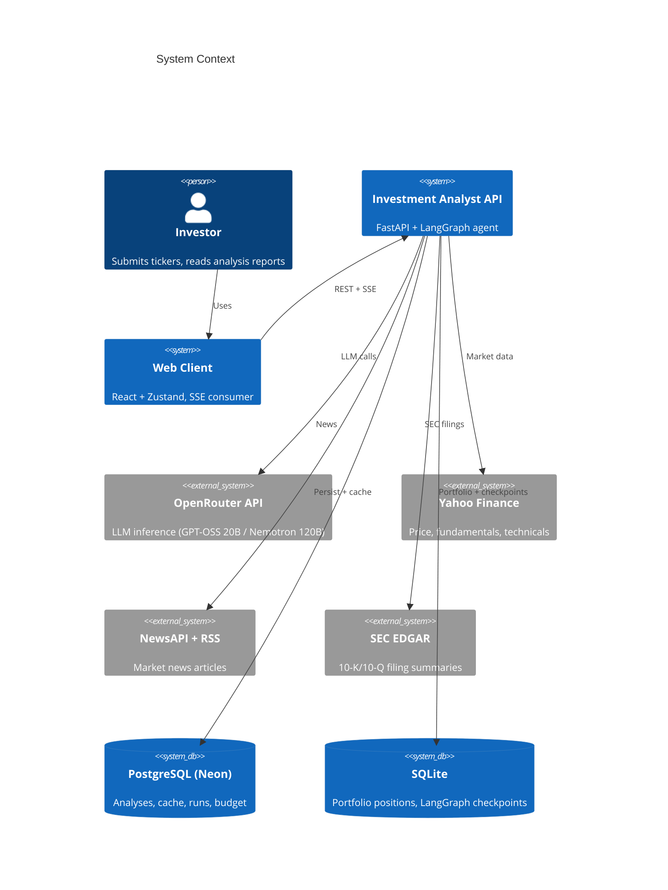
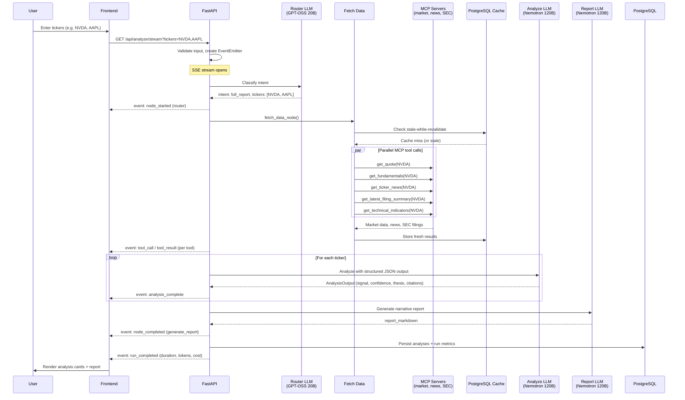
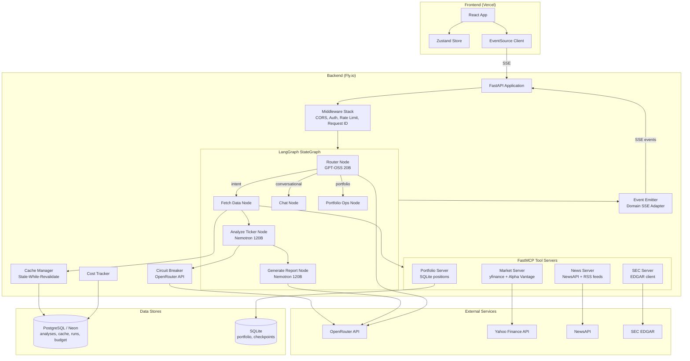

# Architecture

## System Context

AI Investment Analyst is a multi-agent system that produces structured investment analyses for US equities. A user submits one or more ticker symbols, and the system orchestrates data fetching, LLM-powered analysis, and narrative report generation, streaming results back in real time via Server-Sent Events.

The target user is an individual investor who wants a quick, data-backed read on a stock: signal (buy/hold/sell), confidence level, risk flags, and a prose summary with citations to the underlying data sources.



## Request Lifecycle



## Component Diagram



## Data Flow and Trust Boundaries

The system operates across three trust boundaries:

1. **User boundary**: All user input (ticker symbols) is validated with a strict regex (`[A-Z0-9.]{1,10}`) and capped at 5 tickers per request. The demo auth middleware gates analysis endpoints behind a shared password in production.

2. **Backend to LLM provider**: Prompts are constructed server-side with controlled templates. LLM responses are validated against Pydantic schemas (with one retry on validation failure, then a fallback parser). The circuit breaker prevents cascading failures when OpenRouter is degraded.

3. **Backend to data APIs**: MCP tool calls are wrapped with 30-second timeouts. Failures produce `data_gaps` annotations rather than hard errors. The cache layer (stale-while-revalidate) serves stale data when live fetches fail.

```
User Input (untrusted)
    │
    ▼
┌─────────────────────────┐
│  Input Validation        │  regex, max tickers, auth check
│  Rate Limiting (slowapi) │  10 req/min per IP
└─────────────────────────┘
    │
    ▼
┌─────────────────────────┐
│  LangGraph Agent         │  Server-controlled prompts
│  Structured Output       │  Pydantic validation + retry
└─────────────────────────┘
    │                    │
    ▼                    ▼
┌──────────┐      ┌──────────────┐
│ OpenRouter│      │ Data APIs    │
│ API(LLM) │      │ (MCP tools)  │
└──────────┘      └──────────────┘
    │                    │
    ▼                    ▼
┌─────────────────────────┐
│  PostgreSQL              │  Persisted analyses, cache, metrics
└─────────────────────────┘
```

## Key Tradeoffs and Failure Modes

### OpenRouter Rate Limiting

OpenRouter free tier: 20 req/min. When rate-limited:
- The circuit breaker opens after 5 failures within 60 seconds
- During open state (30s recovery), requests receive a `CircuitBreakerOpen` error
- Half-open state allows a single probe request through
- The budget guard checks remaining quota before starting new analyses; if exhausted, the fetch node serves cached-only results

### Tool Failure (MCP servers)

Each of the 5 tool calls per ticker is independently wrapped:
- 30-second timeout per tool call
- Failures produce `data_gaps` entries (e.g., "News data unavailable for NVDA")
- The analysis proceeds with partial data; the LLM output includes a `confidence: "low"` signal when data is missing
- The cache layer attempts stale data before reporting a gap

### Stale Cache

The PostgreSQL cache uses stale-while-revalidate semantics:
- Fresh window: serve cached, no fetch
- Stale window: serve cached immediately, trigger background refresh
- Expired: block on fresh fetch (with timeout fallback to stale)
- Budget-exhausted mode: serve cache-only for all providers, no live API calls

### Execution Timeout

The entire analysis pipeline has a 120-second hard timeout. If exceeded:
- An `error` event is emitted with `recoverable: false`
- Partial results (any completed ticker analyses) are still delivered
- The SSE stream closes gracefully

## Concurrency Model

### Analysis Semaphore

A global `asyncio.Semaphore(3)` limits concurrent full analysis pipelines per backend instance. This prevents overloading the OpenRouter free tier when multiple users submit analyses simultaneously. Requests that cannot acquire a slot within 5 seconds are rejected.

### Parallel Tool Calls

Within a single analysis, the fetch node fires all 5 MCP tool calls per ticker concurrently via `asyncio.gather()`. Multiple tickers are also fetched in parallel. Tool calls are individually timeout-wrapped (30s).

### Circuit Breaker

The `llm_breaker` singleton uses a sliding-window pattern:
- Window: 60 seconds
- Threshold: 5 failures to open
- Recovery: 30 seconds before half-open probe
- States: CLOSED (normal) -> OPEN (rejecting) -> HALF_OPEN (probing)

## Streaming Architecture

The SSE implementation uses a domain event adapter pattern. Raw LangGraph `astream_events` (v2) are never exposed to the frontend. Instead:

1. The `EventEmitter` translates LangGraph lifecycle events into typed domain events
2. Events are pushed to an `asyncio.Queue`
3. A generator pulls from the queue and yields SSE-formatted messages
4. A heartbeat task sends keepalive events every 15 seconds

### Event Envelope

Every SSE event follows a consistent envelope:

```json
{
  "run_id": "uuid",
  "seq": 1,
  "type": "node_started",
  "timestamp": "2026-07-26T10:30:00Z",
  "node": "fetch_data",
  "tool": null,
  "payload": {"node_name": "fetch_data"}
}
```

The `seq` field is monotonically increasing per run, enabling clients to detect gaps after reconnection.

### Event Types

| Type | Emitted when | Payload |
|------|-------------|---------|
| `run_started` | Analysis begins | `{tickers: [...]}` |
| `node_started` | Graph node activates | `{node_name: "..."}` |
| `node_completed` | Graph node finishes | `{node_name: "...", duration_ms: N}` |
| `tool_call` | MCP tool invoked | `{tool_name: "...", args: {...}}` |
| `tool_result` | MCP tool returns | `{tool_name, success, cached, duration_ms, source_id}` |
| `llm_token` | Streaming token | `{text: "..."}` |
| `citation` | Source cited | `{source_id, claim, provider}` |
| `analysis_complete` | Ticker analysis done | `{ticker: "NVDA", analysis: {...}}` |
| `warning` | Non-fatal issue | `{message, context}` |
| `error` | Failure | `{message, recoverable, context}` |
| `run_completed` | All tickers done | `{tickers, total_duration_ms, total_tokens, cost_usd}` |
| `heartbeat` | Keepalive (15s) | `{}` |

### Wire Format (SSE)

```
id: 3
event: tool_result
data: {"run_id":"...","seq":3,"type":"tool_result","timestamp":"...","node":"fetch_data","tool":"get_quote","payload":{"tool_name":"get_quote","success":true,"cached":false,"duration_ms":245,"source_id":"get_quote:1722000000"}}

```

The `id` field enables `Last-Event-ID` reconnection. The empty trailing line is the SSE message delimiter.
